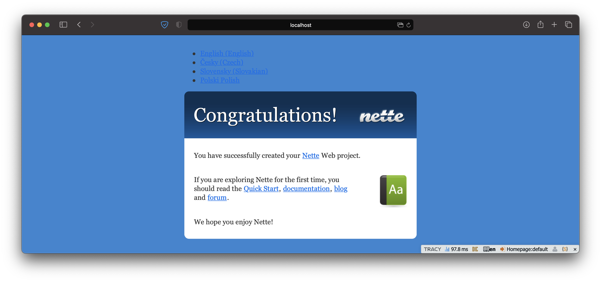

# nette-i18n-example


This is an example repository showing how to use Localazy with Nette and Contributte/Translation for localization management.
To learn more, check out the [blog post](https://localazy.com/blog/how-to-localize-nette-app-using-contributte-translation-and-localazy) describing the set up in detail.

## Sandbox


## Testing out this repo
This repository contains translations from an actual [Localize Nette Application example](https://localazy.com/p/localize-nette-application) app. You can try to run `localazy download` to see how it works. However, this app is in read-only mode, meaning that `localazy upload` will fail. 

First, install dependencies using
```shell
composer install
```

To run the application run the following command from `/www` folder
```shell
php -S localhost:2222
```

## Adjusting for your own project

- sign up for [Localazy](https://localazy.com/register),
- [create an app](https://localazy.com/my/create), although English is recommended, you may use any language as source,
- select *NEON* integration option and install Localazy [CLI](https://localazy.com/docs/cli/installation),
- Retrieve your _writeKey_ and _readKey_ from the integration guide page and change them in `localazy.keys.json`,
- it is recommended to add `localazy.keys.json` to _.gitignore_,
- prepare template(s) for internationalization,
- run `localazy upload`,
- when you have accepted strings in other languages, run `localazy download` and check locales folder for the new translations,
- play around :-)
